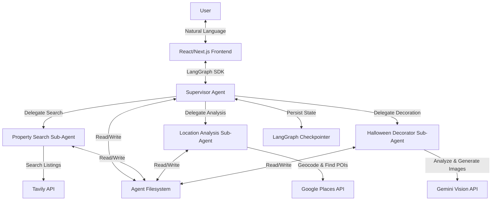

# Design Document

## Overview

The AI Real Estate Co-Pilot is a multi-agent system built on the Deep Agents framework (LangGraph) that automates property search and analysis. The system uses a supervisor pattern where a main agent coordinates two specialized sub-agents: one for property search and one for location analysis. The architecture leverages Deep Agents' built-in capabilities including planning (write_todos), file system management (write_file, read_file), and human-in-the-loop interrupts to create an efficient, user-friendly property search experience.

The system integrates with external APIs (Tavily for web search, Google Places for location data and reviews) and presents results through a React/Next.js frontend that allows users to review and approve properties before detailed analysis.

## Project Structure

```
ai-real-estate-copilot/
├── src/                       # Python backend
│   ├── agent.py               # All agents + SupervisorState
│   ├── main.py                # FastAPI server entry point
│   ├── prompts.py             # System prompts for all agents
│   ├── tools.py               # Tavily, Google Places tools
│   ├── models.py              # Pydantic models
│   └── utils.py               # Helper functions
├── frontend/                  # Next.js frontend
│   └── src/
│       ├── pages/             # Next.js pages
│       │   ├── index.tsx      # Home page
│       │   ├── agent.tsx      # Agent interaction (protected)
│       │   ├── _app.tsx       # App wrapper with ClerkProvider
│       │   ├── _document.tsx  # Document wrapper
│       │   ├── sign-in/       # Clerk sign-in
│       │   ├── sign-up/       # Clerk sign-up
│       │   └── profile/       # User profile (protected)
│       ├── components/        # React components
│       │   ├── ChatInterface.tsx
│       │   ├── Navigation.tsx
│       │   ├── PropertyReportView.tsx
│       │   ├── PropertyReviewPanel.tsx
│       │   ├── PropertySearchForm.tsx
│       │   └── ui/            # Reusable UI components
│       ├── lib/               # Utility functions
│       │   └── utils.ts
│       ├── styles/            # Global styles
│       │   └── globals.css
│       └── middleware.ts      # Clerk route protection
├── tests/                     # Integration tests
├── .env                       # Environment variables
├── requirements.txt           # Python dependencies
└── pyproject.toml             # Python project config (uv)
```

## Architecture

### High-Level Architecture



### Agent Architecture Pattern

The system follows the **Tool Calling** multi-agent pattern where:
- The Supervisor Agent calls sub-agents as tools
- Sub-agents execute their tasks and return results to the supervisor
- Sub-agents don't interact directly with the user
- All routing passes through the supervisor for centralized orchestration

### Technology Stack

**Backend:**
- Deep Agents (deepagents library) - Agent framework with planning and file system capabilities
- LangGraph - Underlying graph execution and state management
- FastAPI - REST API server
- fastapi-clerk-auth - Clerk authentication for FastAPI
- Python 3.11+ - Runtime environment
- uv - Fast Python package manager and project manager
- Tavily API - Web search for property listings
- Google Places API - Location data, geocoding, and nearby points of interest

**Frontend:**
- Next.js 14+ (Pages Router) - React framework
- React 18+ - UI library
- Tailwind CSS - Utility-first CSS framework
- @clerk/nextjs - Authentication and user management
- @langchain/langgraph-sdk - LangGraph client for streaming
- useStream() hook - Handles streaming, state management, and interrupts

**Infrastructure:**
- FastAPI Server - REST API
- LangGraph Checkpointer (MemorySaver) - State persistence
- Agent Filesystem (StateBackend for short-term, StoreBackend for long-term memory)

## Components and Interfaces

### 1. FastAPI Server (src/main.py)

**Purpose:** REST API server entry point

**File Structure:**
```python
# src/main.py
import os
from fastapi import FastAPI, Depends
from fastapi_clerk_auth import ClerkConfig, ClerkHTTPBearer, HTTPAuthorizationCredentials
from src.agent import supervisor_agent
from src.models import AgentRequest, ResumeRequest

app = FastAPI()

# Clerk authentication
clerk_config = ClerkConfig(jwks_url=os.getenv("CLERK_JWKS_URL"))
clerk_guard = ClerkHTTPBearer(clerk_config)

@app.post("/api/invoke")
def invoke_agent(
    request: AgentRequest,
    creds: HTTPAuthorizationCredentials = Depends(clerk_guard)
):
    user_id = creds.decoded["sub"]
    thread_id = f"{user_id}-{request.timestamp}"
    config = {"configurable": {"thread_id": thread_id}}
    result = supervisor_agent.invoke(request.dict(), config=config)
    return result

@app.post("/api/resume")
def resume_agent(
    request: ResumeRequest,
    creds: HTTPAuthorizationCredentials = Depends(clerk_guard)
):
    user_id = creds.decoded["sub"]
    config = {"configurable": {"thread_id": request.thread_id}}
    result = supervisor_agent.invoke(request.dict(), config=config)
    return result

@app.get("/api/state")
def get_state(
    thread_id: str,
    creds: HTTPAuthorizationCredentials = Depends(clerk_guard)
):
    config = {"configurable": {"thread_id": thread_id}}
    state = supervisor_agent.get_state(config)
    return state
```

**CORS configured** - Allows frontend to communicate with backend

### 2. Supervisor Agent

**Purpose:** Main orchestrator that manages user conversation, gathers requirements, and coordinates sub-agents

**Configuration:**
```python
from langgraph.checkpoint.postgres import PostgresSaver

# Development
checkpointer = MemorySaver()

# Production
checkpointer = PostgresSaver.from_conn_string(
    os.getenv("DATABASE_URL")
)

supervisor_agent = create_deep_agent(
    model=model,  # Any LLM (GPT-4, Claude, etc.)
    system_prompt=SUPERVISOR_SYSTEM_PROMPT,
    tools=[],  # No external tools, uses sub-agents
    subagents=[property_search_agent, location_analysis_agent],
    checkpointer=checkpointer,
    interrupt_on={"present_properties_for_review": True}
)
```

**Responsibilities:**
- Engage in natural language conversation with users
- Extract and validate property search criteria
- Use write_todos to create and maintain execution plan
- Delegate search tasks to Property Search Agent
- Trigger human-in-the-loop interrupt for property review
- Delegate location analysis to Location Analysis Agent
- Compile final Property Report from filesystem data
- Handle errors and retry logic

**State Schema:**
```python
class SupervisorState(TypedDict):
    messages: Annotated[list, add_messages]
    todos: list[dict]  # Task list with status
    search_criteria: dict  # User requirements
    approved_properties: list[str]  # Property IDs approved by user
    filesystem: dict  # File paths and metadata
```

### 2. Property Search Sub-Agent

**Purpose:** Specialized agent for finding property listings using web search

**Configuration:**
```python
property_search_agent = {
    "name": "property_search",
    "description": "Searches for property listings matching user criteria using web search",
    "system_prompt": PROPERTY_SEARCH_SYSTEM_PROMPT,
    "tools": [tavily_search_tool, tavily_extract_tool],
    "model": model  # Any LLM (GPT-4, Claude, etc.)
}
```

**Responsibilities:**
- Construct effective search queries from criteria
- Call Tavily API to find property listings
- Parse and extract structured data from search results
- Extract image URLs from listings
- Write results to filesystem (one file per property)
- Return summary of found properties to supervisor

**Tool Interface:**
```python
def tavily_search_tool(
    query: str,
    max_results: int = 10,
    include_raw_content: bool = True,
    search_depth: str = "advanced"
) -> dict:
    """Search for property listings using Tavily API"""
```

**Filesystem Structure:**
```
/properties/
  property_001.json
  property_002.json
  ...
```

### 3. Location Analysis Sub-Agent

**Purpose:** Specialized agent for analyzing property locations and nearby amenities

**Configuration:**
```python
location_analysis_agent = {
    "name": "location_analysis",
    "description": "Analyzes property locations and finds nearby points of interest",
    "system_prompt": LOCATION_ANALYSIS_SYSTEM_PROMPT,
    "tools": [google_places_geocode_tool, google_places_nearby_tool],
    "model": model  # Any LLM (GPT-4, Claude, etc.)
}
```

### 4. Halloween Decorator Sub-Agent

**Purpose:** Specialized agent for analyzing property images and generating Halloween-decorated versions

**Configuration:**
```python
halloween_decorator_agent = {
    "name": "halloween_decorator",
    "description": "Analyzes property images and generates Halloween-themed decorated versions",
    "system_prompt": HALLOWEEN_DECORATOR_SYSTEM_PROMPT,
    "tools": [analyze_property_images_tool, generate_decorated_image_tool],
    "model": model  # Any LLM (GPT-4, Claude, etc.)
}
```

**Workflow:**
1. Supervisor passes property image URLs from Property Search Agent results
2. Halloween Decorator Agent calls `analyze_property_images_tool` to scan each image
3. Analysis identifies: room type, decoration spaces, style notes, and suggestions
4. Agent calls `generate_decorated_image_tool` with the image URL and decoration description
5. Gemini Vision generates a Halloween-decorated version of the property image
6. Decorated images (base64) are returned to Supervisor for inclusion in final report

**Tool Interfaces:**
```python
def analyze_property_images_tool(image_url: str) -> dict:
    """Analyze property image for Halloween decoration opportunities using Gemini Vision"""
    # Returns: room_type, decoration_spaces, style_notes, suggestions

def generate_decorated_image_tool(image_url: str, decoration_description: str) -> dict:
    """Generate Halloween-decorated version of property image using Gemini"""
    # Returns: decorated_image_base64, original_image_url, decorations_added
```

**Filesystem Structure:**
```
/decorations/
  property_001_decorated.json  # Contains base64 image and metadata
  property_002_decorated.json
  ...
```

### 4. Frontend to API Integration

**Request Flow:**
```typescript
// pages/agent.tsx
import { useUser, useAuth } from '@clerk/nextjs';

export default function AgentPage() {
  const { user } = useUser();
  const { getToken } = useAuth();
  
  const sendMessage = async (content: string) => {
    const jwt = await getToken();
    
    const response = await fetch('/api/invoke', {
      method: 'POST',
      headers: {
        'Content-Type': 'application/json',
        'Authorization': `Bearer ${jwt}`
      },
      body: JSON.stringify({
        messages: [{ role: 'user', content }],
        timestamp: Date.now()
      })
    });
    
    const result = await response.json();
    return result;
  };
}
```

**Responsibilities:**
- Geocode property addresses using Google Places Text Search API
- Search for nearby points of interest by category: restaurants, cafes, shopping, parks, schools, hospitals, gyms, transit stations
- Calculate distances to nearby POIs
- Analyze location pros and cons based on nearby amenities
- Write analysis to filesystem
- Return structured analysis to supervisor

**Tool Interfaces:**
```python
def google_places_geocode_tool(address: str, country: str = None) -> dict:
    """Convert address to coordinates using Google Places Text Search API"""

def google_places_nearby_tool(
    latitude: float,
    longitude: float,
    category: str,
    radius_meters: int = 5000,
    limit: int = 10
) -> list[dict]:
    """Find nearby points of interest by category"""
```

**Filesystem Structure:**
```
/locations/
  property_001_location.json
  property_002_location.json
  ...
```

### 5. Next.js Frontend with Clerk Authentication

**Purpose:** User interface for authentication, conversation, and property review

**Page Structure (Pages Router):**

**1. Home Page (Public Route: `pages/index.tsx`)**
- Landing page with application overview
- Sign-in and sign-up buttons using Clerk components
- Hero section explaining the AI property search features
- Call-to-action to get started

**2. Sign-In Page (Public Route: `pages/sign-in/[[...index]].tsx`)**
- Clerk `<SignIn />` component
- Styled to match application design
- Redirects to agent page after successful authentication

**3. Sign-Up Page (Public Route: `pages/sign-up/[[...index]].tsx`)**
- Clerk `<SignUp />` component
- Styled to match application design
- Redirects to agent page after successful registration

**4. Agent Interaction Page (Protected Route: `pages/agent.tsx`)**
- Main application interface for property search
- Chat interface for conversation with supervisor agent
- Property review panel for approving/rejecting listings
- Property report view for final results
- Requires authentication via Clerk middleware

**5. Profile Page (Protected Route: `pages/profile/[[...index]].tsx`)**
- Clerk `<UserProfile />` component
- User account management and settings
- Profile picture, email, password management
- Connected accounts and security settings

**Key Components (frontend/src/components/):**

**Navigation.tsx:**
- Responsive navbar with logo and navigation links
- Clerk `<UserButton />` for authenticated users
- Sign-in/sign-up buttons for unauthenticated users
- Mobile-responsive hamburger menu

**ChatInterface.tsx (Agent Page):**
- Displays conversation with supervisor agent
- Uses useStream() hook for streaming responses
- Shows agent's task list for progress visibility
- Message history with user and agent messages

**PropertyReviewPanel.tsx (Agent Page):**
- Triggered by human-in-the-loop interrupt
- Displays property cards with images and details
- Provides checkboxes for approval/rejection
- Submits selections to resume agent execution

**PropertyReportView.tsx (Agent Page):**
- Displays final comprehensive report
- Shows property details, images, and location analysis
- Presents pros/cons in structured format
- Export or share functionality

**PropertySearchForm.tsx (Agent Page):**
- Form for entering property search criteria
- Location, price range, bedrooms, property type inputs
- Validates and submits search to agent

**ui/ (Reusable Components):**
- Shared UI components (buttons, inputs, cards, etc.)
- Styled with Tailwind CSS

**Authentication Integration (Pages Router):**
```typescript
// frontend/src/middleware.ts - Route protection
import { clerkMiddleware, createRouteMatcher } from '@clerk/nextjs/server';

const isProtectedRoute = createRouteMatcher([
  '/agent(.*)',
  '/profile(.*)'
]);

export default clerkMiddleware((auth, req) => {
  if (isProtectedRoute(req)) auth().protect();
});

export const config = {
  matcher: [
    '/((?!_next|[^?]*\\.(?:html?|css|js(?!on)|jpe?g|webp|png|gif|svg|ttf|woff2?|ico|csv|docx?|xlsx?|zip|webmanifest)).*)',
    '/(api|trpc)(.*)',
  ],
};

// frontend/src/pages/_app.tsx - Clerk provider
import { ClerkProvider } from '@clerk/nextjs';
import type { AppProps } from 'next/app';
import '@/styles/globals.css';

export default function App({ Component, pageProps }: AppProps) {
  return (
    <ClerkProvider {...pageProps}>
      <Component {...pageProps} />
    </ClerkProvider>
  );
}

// frontend/src/pages/agent.tsx - LangGraph integration with user context
import { useUser } from '@clerk/nextjs';
import { useStream } from '@langchain/langgraph-sdk';
import { GetServerSideProps } from 'next';
import { getAuth } from '@clerk/nextjs/server';

export default function AgentPage() {
  const { user } = useUser();
  
  const { messages, isLoading, interrupt, streamMessage } = useStream({
    apiUrl: process.env.NEXT_PUBLIC_LANGGRAPH_API_URL,
    threadId: `${user?.id}-${Date.now()}`,
    assistantId: "real-estate-copilot"
  });

  // Handle interrupt for property review
  if (interrupt?.type === "present_properties_for_review") {
    const properties = interrupt.payload.properties;
    // Show PropertyReviewPanel
  }

  // Resume after user approval
  const resumeWithApprovals = async (approvedIds: string[]) => {
    await streamMessage({
      approved_properties: approvedIds
    });
  };
  
  return (
    // Chat interface UI
  );
}

// Server-side authentication check
export const getServerSideProps: GetServerSideProps = async (ctx) => {
  const { userId } = getAuth(ctx.req);
  
  if (!userId) {
    return {
      redirect: {
        destination: '/sign-in',
        permanent: false,
      },
    };
  }
  
  return { props: {} };
};
```

**Styling with Tailwind CSS:**
- Consistent design system with custom color palette
- Responsive breakpoints for mobile, tablet, desktop
- Custom Clerk component styling via `appearance` prop
- Dark mode support (optional)
- Smooth transitions and animations

## Data Models

### Property Model

```python
class Property(BaseModel):
    id: str
    address: str
    city: str
    state: str
    zip_code: str
    price: float
    bedrooms: int
    bathrooms: float
    square_feet: int
    property_type: str  # house, condo, apartment, etc.
    listing_url: str
    image_urls: list[str]
    description: str
    listing_date: datetime
```

### Location Analysis Model

```python
class PointOfInterest(BaseModel):
    name: str
    category: str  # restaurant, cafe, park, shopping_mall, school, hospital, gym, transit_station
    distance_meters: float
    address: str
    latitude: float
    longitude: float
    rating: Optional[float]
    user_ratings_total: Optional[int]

class LocationAnalysis(BaseModel):
    property_id: str
    latitude: float
    longitude: float
    nearby_pois: list[PointOfInterest]
    pros: list[str]
    cons: list[str]
    walkability_score: Optional[int]
    transit_score: Optional[int]
```

### Search Criteria Model

```python
class SearchCriteria(BaseModel):
    location: str  # city, neighborhood, or zip code
    min_price: Optional[float]
    max_price: Optional[float]
    min_bedrooms: Optional[int]
    max_bedrooms: Optional[int]
    min_bathrooms: Optional[float]
    property_types: list[str]
    max_results: int = 10
```

### Property Report Model

```python
class PropertyReport(BaseModel):
    search_criteria: SearchCriteria
    properties: list[Property]
    location_analyses: dict[str, LocationAnalysis]  # property_id -> analysis
    generated_at: datetime
    summary: str
```

## Error Handling

### API Failures

**Handling:**
- Catch API exceptions in sub-agents
- Return error status to supervisor
- Supervisor updates task list with failure status
- Supervisor informs user and offers retry or skip options

### Context Overflow Prevention

**Strategy:** Aggressive use of filesystem

- Property Search Agent writes each property to separate file immediately after extraction
- Location Analysis Agent writes analysis to separate file per property
- Supervisor reads from filesystem only when compiling final report
- Use read_file with line limits when previewing data

### State Recovery

**Strategy:** LangGraph checkpointing

- All agent state persisted after each step
- User can resume from any interrupt point
- Filesystem contents preserved in state
- Thread ID used to restore exact conversation state

## Testing Strategy

### Integration Tests (Primary Testing Approach)

**LangGraph Workflow Testing:**

The primary testing approach uses direct LangGraph workflow invocation to test the entire agent system end-to-end. This approach tests all components together as they would run in production.

```python
import pytest
from app import supervisor_agent
from langgraph.checkpoint.memory import MemorySaver

@pytest.fixture
def test_config():
    return {
        "configurable": {
            "thread_id": "test-thread-123"
        }
    }

def test_complete_property_search_workflow(test_config):
    """Test the complete workflow from search prompt to final report"""
    
    # User's search prompt
    user_input = {
        "messages": [{
            "role": "user",
            "content": "Find me 3-bedroom houses in Seattle under $800k"
        }]
    }
    
    # Invoke the supervisor agent workflow
    result = supervisor_agent.invoke(user_input, config=test_config)
    
    # Assertions
    assert "messages" in result
    assert len(result["messages"]) > 1
    assert "todos" in result
    assert result["search_criteria"]["location"] == "Seattle"
    assert result["search_criteria"]["min_bedrooms"] == 3
    assert result["search_criteria"]["max_price"] == 800000

def test_human_in_the_loop_interrupt(test_config):
    """Test that the workflow correctly interrupts for property review"""
    
    user_input = {
        "messages": [{
            "role": "user",
            "content": "Find condos in San Francisco"
        }]
    }
    
    # First invocation should hit the interrupt
    result = supervisor_agent.invoke(user_input, config=test_config)
    
    # Check for interrupt
    assert "__interrupt__" in result or result.get("next") == ["present_properties_for_review"]
    
    # Resume with approvals
    approval_input = {
        "approved_properties": ["property_001", "property_002"]
    }
    
    final_result = supervisor_agent.invoke(approval_input, config=test_config)
    assert "location_analyses" in final_result or len(final_result["messages"]) > 0

def test_property_rejection_and_research(test_config):
    """Test that rejecting properties triggers additional search"""
    
    # Initial search
    user_input = {
        "messages": [{
            "role": "user", 
            "content": "Find apartments in Austin"
        }]
    }
    
    result = supervisor_agent.invoke(user_input, config=test_config)
    
    # Reject all properties
    rejection_input = {
        "approved_properties": []
    }
    
    result = supervisor_agent.invoke(rejection_input, config=test_config)
    
    # Should trigger new search
    assert any("search" in str(todo).lower() for todo in result.get("todos", []))

def test_error_handling_invalid_location(test_config):
    """Test error handling with invalid search criteria"""
    
    user_input = {
        "messages": [{
            "role": "user",
            "content": "Find houses in NonexistentCity12345"
        }]
    }
    
    result = supervisor_agent.invoke(user_input, config=test_config)
    
    # Should handle gracefully and ask for clarification
    last_message = result["messages"][-1]["content"]
    assert "clarify" in last_message.lower() or "not found" in last_message.lower()
```

**Trajectory Testing with AgentEvals:**

Use LangChain's agentevals package to validate agent decision-making:

```python
from langchain.evaluation import trajectory_match, llm_as_judge

def test_agent_trajectory_match():
    """Test that agent follows expected tool call sequence"""
    
    expected_trajectory = [
        {"type": "tool_call", "tool": "write_todos"},
        {"type": "tool_call", "tool": "task", "subagent": "property_search"},
        {"type": "interrupt", "reason": "present_properties_for_review"},
        {"type": "tool_call", "tool": "task", "subagent": "location_analysis"},
        {"type": "message", "contains": "Property Report"}
    ]
    
    # Run agent and compare trajectory
    result = trajectory_match(
        agent=supervisor_agent,
        input="Find 2-bedroom apartments in Portland under $500k",
        expected_trajectory=expected_trajectory
    )
    
    assert result.passed

def test_agent_quality_with_llm_judge():
    """Use LLM to evaluate agent's decision quality"""
    
    rubric = """
    Evaluate if the agent:
    1. Correctly extracted search criteria from user input
    2. Delegated to appropriate sub-agents
    3. Provided comprehensive location analysis
    4. Compiled a well-structured final report
    """
    
    result = llm_as_judge(
        agent=supervisor_agent,
        input="Find family homes near good schools in Denver",
        rubric=rubric
    )
    
    assert result.score >= 0.8
```

### Unit Tests (Minimal, Focused on Core Logic)

**Critical Utility Functions Only:**

```python
def test_extract_search_criteria_from_text():
    """Test criteria extraction logic"""
    text = "I want a 3-bedroom house in Seattle under $800k"
    criteria = extract_search_criteria(text)
    assert criteria["min_bedrooms"] == 3
    assert criteria["location"] == "Seattle"
    assert criteria["max_price"] == 800000

def test_calculate_distance_between_coordinates():
    """Test distance calculation utility"""
    coord1 = (47.6062, -122.3321)  # Seattle
    coord2 = (47.6101, -122.3421)  # Nearby point
    distance = calculate_distance(coord1, coord2)
    assert 0 < distance < 2000  # meters
```

## Deployment Considerations

### Development Environment

- Use MemorySaver checkpointer for development
- Use StateBackend filesystem (in-memory)
- Mock API responses for faster iteration
- Run FastAPI server locally with `uvicorn api.index:app --reload`
- Run Next.js dev server locally with `cd frontend && npm run dev`

### Production Environment

**Deployment Options:**
- Docker container deployment (Railway, Render, AWS App Runner)
- Frontend and backend can be deployed together or separately
- Use PostgreSQL checkpointer for production state persistence

### Architecture

```
┌─────────────────────────────────────────────────────┐
│   Application Architecture                          │
│                                                      │
│  ┌──────────────────────────────────────────────┐  │
│  │   Next.js Frontend (frontend/src/)           │  │
│  │   - pages/index.tsx (home)                   │  │
│  │   - pages/sign-in/[[...index]].tsx           │  │
│  │   - pages/sign-up/[[...index]].tsx           │  │
│  │   - pages/agent.tsx (protected)              │  │
│  │   - pages/profile/[[...index]].tsx           │  │
│  │   - components/ (UI components)              │  │
│  │   - middleware.ts (Clerk route protection)   │  │
│  └──────────────────────────────────────────────┘  │
│                 │                                    │
│                 │ JWT Bearer Token                   │
│                 ↓                                    │
│  ┌──────────────────────────────────────────────┐  │
│  │   FastAPI Server (src/main.py)               │  │
│  │   - POST /api/invoke                         │  │
│  │   - POST /api/resume                         │  │
│  │   - GET /api/state                           │  │
│  │   - ClerkHTTPBearer authentication           │  │
│  └──────────────────────────────────────────────┘  │
│                 │                                    │
│                 │ imports                            │
│                 ↓                                    │
│  ┌──────────────────────────────────────────────┐  │
│  │   Deep Agents (src/)                         │  │
│  │   - src/agent.py (supervisor + sub-agents)   │  │
│  │   - src/tools.py (Tavily, Google Places)     │  │
│  │   - src/models.py (Pydantic models)          │  │
│  │   - src/prompts.py (system prompts)          │  │
│  │   - src/utils.py (helpers)                   │  │
│  └──────────────────────────────────────────────┘  │
│                 │                                    │
│                 │ checkpointer                       │
│                 ↓                                    │
│  ┌──────────────────────────────────────────────┐  │
│  │   MemorySaver (Development)                  │  │
│  │   - Agent State Persistence                  │  │
│  │   - Thread Storage                           │  │
│  └──────────────────────────────────────────────┘  │
└─────────────────────────────────────────────────────┘
```

### Monitoring and Observability

- Use LangSmith for agent execution tracing and monitoring
- Set up error tracking with Sentry or similar
- Configure alerts for API failures
- Monitor application logs
